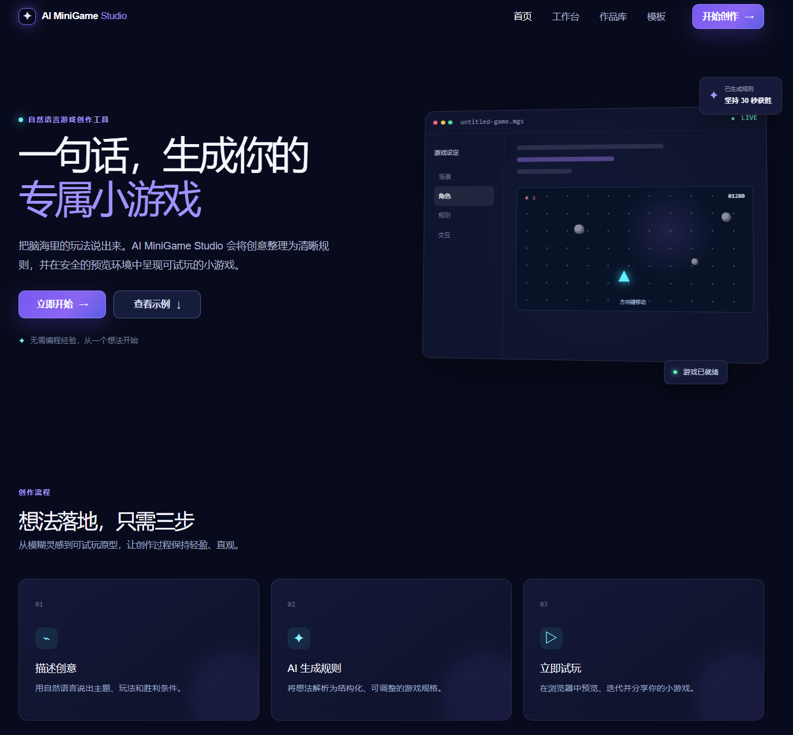
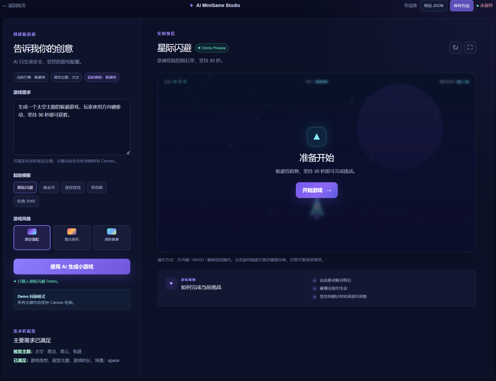
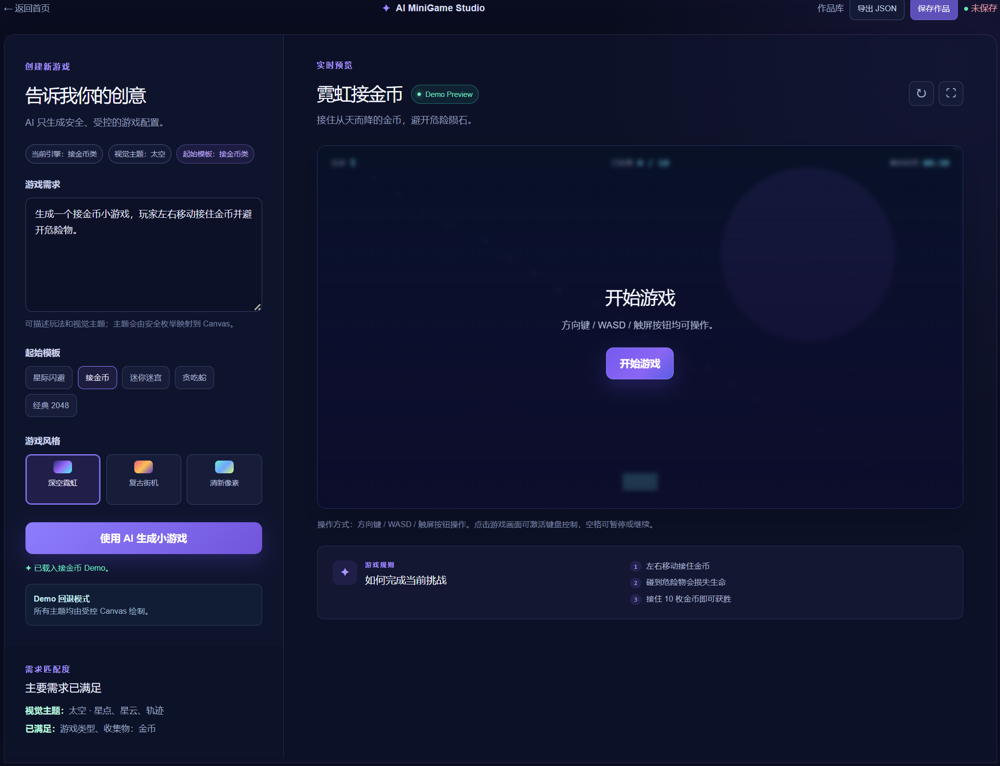
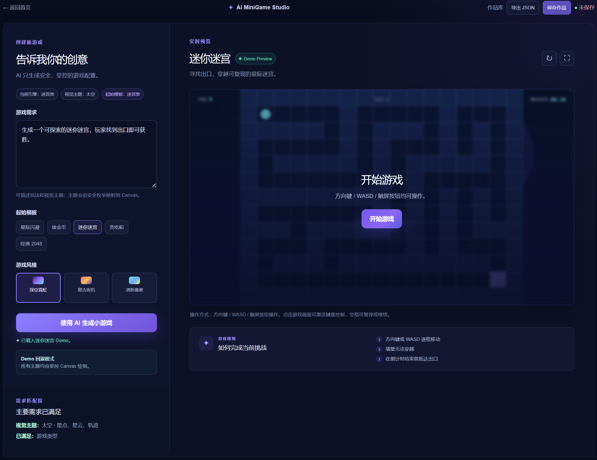
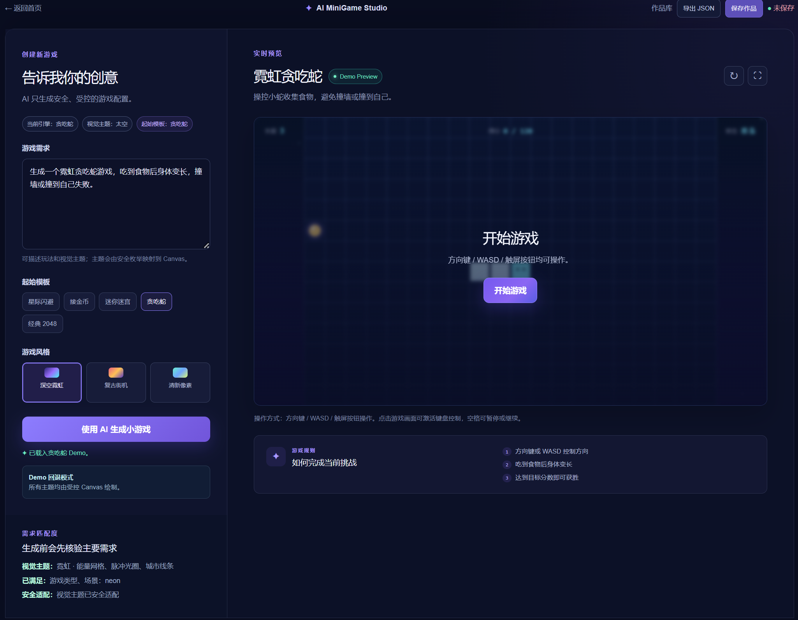
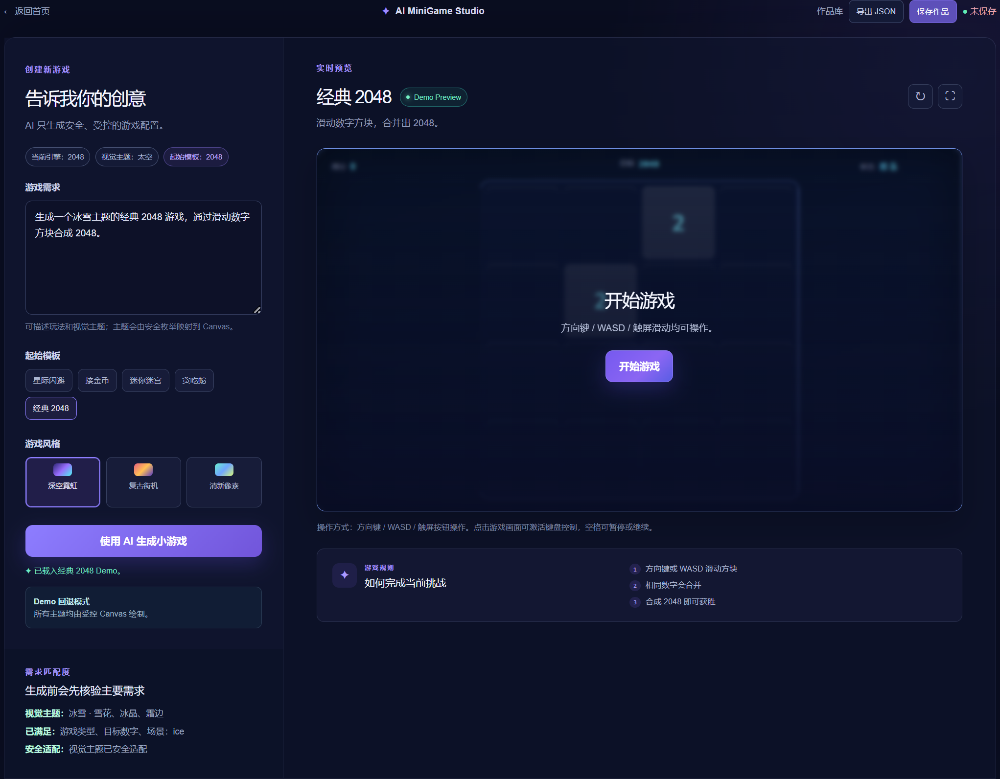
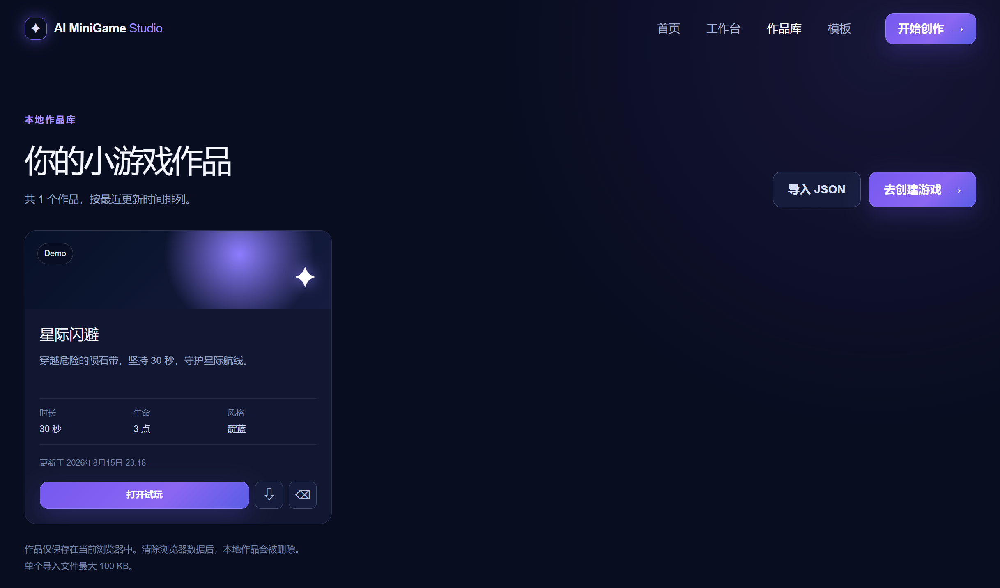

# AI MiniGame Studio

> **在线试玩：** https://ai-minigame-studio.onrender.com
>
> 该演示部署在 Render 免费套餐上；若服务空闲，首次访问可能需要约一分钟唤醒。

AI MiniGame Studio 是一个通过自然语言生成可玩小游戏配置，并在浏览器中即时试玩的 Web 工具。它将 AI 生成限制在经过校验的 `GameSpec` 数据内，由本地受控游戏引擎负责运行，适合作为 AI 应用与前端工程实践作品展示。



## 核心功能

- 中文自然语言创意输入与需求解析。
- DeepSeek Chat Completions 生成严格 JSON 配置。
- 五套受控游戏引擎：星际闪避（`dodge`）、接金币（`collect`）、迷你迷宫（`maze`）、贪吃蛇（`snake`）和经典 2048（`2048`）。
- 七种程序化视觉主题：太空、海洋、熔岩、冰雪、森林、霓虹、沙漠。
- 需求匹配面板：展示已满足、安全适配和暂不支持的需求。
- 键盘、WASD、触屏控制，以及开始、暂停、继续、重新开始和全屏预览。
- 浏览器本地作品库：保存、打开、删除，以及 JSON 导入/导出。

## 五种可玩游戏

<table>
  <tr>
    <td width="50%" align="center"><strong>星际闪避 · dodge</strong><br></td>
    <td width="50%" align="center"><strong>接金币 · collect</strong><br></td>
  </tr>
  <tr>
    <td width="50%" align="center"><strong>迷你迷宫 · maze</strong><br></td>
    <td width="50%" align="center"><strong>贪吃蛇 · snake</strong><br></td>
  </tr>
</table>

<p align="center"><strong>经典 2048 · 2048</strong><br></p>

## 自然语言生成流程

用户输入游戏创意后，客户端先提取玩法、主题、时长、生命和目标数量等约束，再调用 `POST /api/generate`。服务端请求 DeepSeek，解析 JSON，并使用严格的 `GameSpecSchema` 二次验证；需求匹配通过后，Studio 才会替换当前游戏并允许试玩。没有 AI 服务配置时仍可使用内置 Demo。

## DeepSeek API 配置

项目使用官方 `openai` JavaScript SDK 的兼容接口方式调用 DeepSeek Chat Completions。服务端只从环境变量读取配置，客户端不会接触 API Key。

复制 `.env.example` 的变量到本地环境文件，并替换占位值：

```text
DEEPSEEK_API_KEY=your_deepseek_api_key_here
DEEPSEEK_BASE_URL=https://api.deepseek.com
DEEPSEEK_MODEL=deepseek-v4-flash
```

不要把真实 Key 写入 Git，也不要在浏览器、日志或导出 JSON 中暴露 Key。

## 安全运行机制

- `GameSpecSchema` 使用 Zod 严格判别联合，限制玩法类型、字段、数值范围、颜色和数组长度。
- DeepSeek 只能返回配置 JSON，不能返回或执行 JavaScript、HTML、CSS、URL 或脚本。
- 服务端执行 `JSON.parse`、Schema 校验和需求匹配，失败时保留当前 Demo。
- 运行时只分派到固定的 dodge、collect、maze、snake、2048 引擎，不使用 `eval`、`new Function` 或动态脚本。
- 主题、收集物和危险物均为受控枚举，Canvas/DOM 只绘制内置图形。

## 本地作品库



作品以版本化 `SavedGame` 记录保存到当前浏览器的 `localStorage`，包含 `id`、`schemaVersion`、`gameSpec`、来源、创意、风格和时间信息。最多保留 20 个作品；损坏记录会被安全忽略。作品库支持按更新时间排序、打开试玩、删除、导出 JSON 和导入 JSON，导入会生成新 ID。

作品仅保存在当前浏览器中，清除浏览器数据后会被删除，不提供云同步。

## 技术栈

- Next.js 16 App Router
- React 19、TypeScript
- Zod 运行时 Schema
- DeepSeek API（通过官方 `openai` SDK 兼容调用）
- 原生 HTML5 Canvas、CSS、Tailwind CSS/PostCSS
- Vitest、ESLint

## 项目架构

```text
src/app                 页面、布局与 /api/generate Route Handler
src/components          首页、Studio、预览、需求匹配和作品库 UI
src/game-engine         五套纯 TypeScript 游戏逻辑与 Canvas 渲染
src/schemas             GameSpec 与请求 Schema
src/lib/ai              DeepSeek 客户端、提示词、生成和错误处理
src/lib/requirements    中文需求解析与匹配
src/lib/storage         SavedGame 本地存储、导入导出
src/data                Demo 游戏和风格配置
src/types               GameSpec/SavedGame 类型入口
docs/ARCHITECTURE.md    数据流和安全架构说明
```

更完整的数据流见 [docs/ARCHITECTURE.md](docs/ARCHITECTURE.md)。

## Windows 本地运行

要求：Node.js 以及 npm。

```powershell
cd D:\Project\ai-minigame-studio
npm.cmd install
Copy-Item .env.example .env.local
# 编辑 .env.local，填入你自己的 DeepSeek Key
npm.cmd run dev
```

打开 `http://localhost:3000`。不配置 Key 时可以继续使用 Demo 模板和本地游戏引擎。

## 常用命令

```powershell
npm.cmd run dev      # 启动开发服务器
npm.cmd run lint     # ESLint 检查
npm.cmd run test     # Vitest 单元测试
npm.cmd run build    # 生产构建
npm.cmd run start    # 启动生产服务器
```

## 测试与构建

测试覆盖五种游戏的核心纯逻辑、碰撞/移动/合并、主题标准化、需求解析、AI mock、Schema、作品库和 2048 固定布局。API 测试使用 mock，不向外网发送真实 DeepSeek 请求。提交前建议依次运行 `npm.cmd run lint`、`npm.cmd run test` 和 `npm.cmd run build`。

## 当前限制与后续规划

- AI 生成依赖本地 DeepSeek 配置，未配置时使用 Demo 回退。
- 作品目前只保存在浏览器 localStorage，不支持账号、云同步和跨设备协作。
- 线上部署地址和演示视频将在后续补充。
- 后续可继续完善更多主题动效、作品分享和可选的服务端持久化；新增玩法仍需先实现受控引擎与 Schema。

## 简历项目亮点

> 独立实现基于 Next.js、TypeScript 和 DeepSeek 的自然语言小游戏生成工作台：通过 Zod 严格 GameSpec、需求匹配和受控 Canvas 引擎保障 AI 输出安全运行；完成 dodge、collect、maze、snake、2048 五类游戏、七种程序化视觉主题、响应式交互及 localStorage 作品库，并配套 Vitest 自动化测试与生产构建流程。
