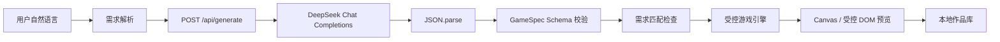

# AI MiniGame Studio 架构说明

## 生成与运行数据流

Studio 会在客户端提取玩法类型、视觉主题和用户明确数字，服务端再次校验并合并这些约束。生成结果只有在 JSON 解析、`GameSpecSchema.safeParse` 和需求匹配都成功后，才会替换当前游戏；失败时保留原有 Demo。

## 为什么不执行 AI 返回的代码

AI 输出被视为不可信的配置数据，而不是程序。项目不接受 JavaScript、HTML、CSS、外部资源 URL 或事件处理代码，也不使用 `eval`、`new Function` 和动态脚本注入。Zod 严格 Schema 会拒绝未知字段、跨玩法字段、非法颜色和越界数值；前端只将通过验证的配置交给固定的五套游戏引擎。这样既能保留自然语言生成的灵活性，又能把执行面限制在可测试的移动、碰撞、合并、计时和 Canvas 绘制逻辑内。

## 主要模块

- `src/lib/requirements`：从中文创意提取玩法、主题、数字和不支持需求。
- `src/lib/ai`：DeepSeek 客户端、JSON 输出提示、有限重试、错误映射和请求节流。
- `src/schemas/game-spec.ts`：五种 `genre` 的严格判别联合。
- `src/game-engine`：dodge、collect、maze、snake、2048 的纯逻辑与渲染支持。
- `src/lib/storage`：版本化 `SavedGame`、localStorage 安全读取和 JSON 导入导出。
